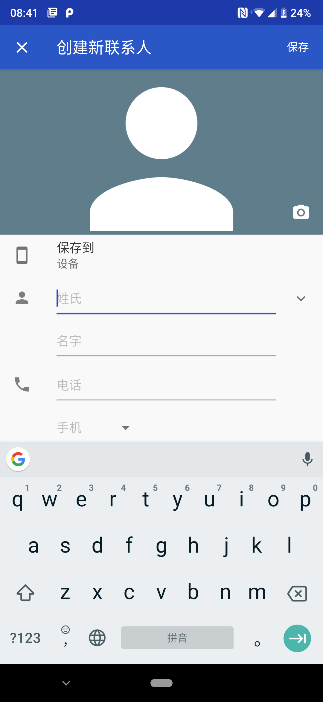
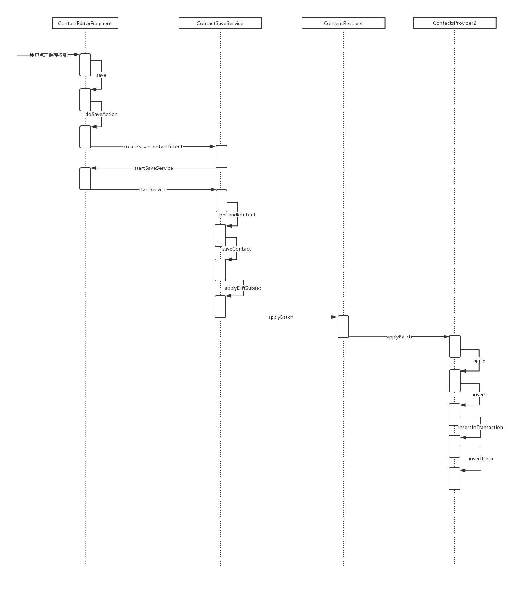

# **Contacts**
## **一、独立化**

### **1.拷贝代码资源文件**

移植目录清单：

packages/apps/Contacts

packages/apps/PhoneCommon/src/com/android/phone/common/animation/AnimationListenerAdapter.java

packages/apps/PhoneCommon/src/com/android/phone/common/animation/AnimUtils.java

packages/apps/PhoneCommon/src/com/android/phone/common/compat/PathInterpolatorCompat.java

packages/apps/PhoneCommon/src/com/android/phone/common/PhoneConstants.java

frameworks/opt/vcard

### **2.修改gradle文件**
```
apply plugin: 'com.android.application'

android {
    compileSdkVersion 28
    defaultConfig {
        applicationId "com.android.contacts"
        minSdkVersion 21
        targetSdkVersion 28
        versionCode VERSION_CODE as int
        versionName VERSION_NAME
    }
    sourceSets.main {
        java.srcDirs = ['Contacts/src', 'Contacts/src-bind', 'PhoneCommon/src', 'Vcard/java']
        manifest.srcFile 'Contacts/AndroidManifest.xml'
        res.srcDirs = ['Contacts/res']
    }
    buildTypes {
        release {
            minifyEnabled false
            proguardFiles getDefaultProguardFile('proguard-android-optimize.txt'), 'proguard-rules.pro', 'proguard.flags'
        }
    }
    lintOptions {
        checkReleaseBuilds false
        // Or, if you prefer, you can continue to check for errors in release builds,
        // but continue the build even when errors are found:
        abortOnError false
    }
}

dependencies {
    implementation 'com.android.support:appcompat-v7:28.0.0'
    implementation 'com.android.support:cardview-v7:28.0.0'
    implementation 'com.android.support:palette-v7:28.0.0'
    implementation 'com.android.support:recyclerview-v7:28.0.0'
    implementation 'com.android.support:design:28.0.0'
    // must be 18.0, else erro
    implementation 'com.google.guava:guava:18.0'
    implementation 'com.googlecode.libphonenumber:libphonenumber:8.10.8'
    implementation 'com.googlecode.libphonenumber:geocoder:2.114'
    implementation ('com.google.code.findbugs:findbugs:3.0.1') {exclude group: 'org.ow2.asm'}
}
```
注意：

依赖com.google.guava:guava一定要指定版本为18.0
依赖com.google.code.findbugs:findbugs:3.0.1 需要排除org.ow2.asm依赖

## **二、Contacts源码分析**
### **1.Contact简介**

### **2.Contacts各功能模块分析**
#### **2.1增**

Contacts通过点击主界面的 **+** 号来启动添加新的通讯人员界面，界面如下：



对应Activity：```com/android/contacts/activities/ContactEditorActivity.java```

对应Fragment：```com/android/contacts/editor/ContactEditorFragment.java```




### 删

### 改

### 查


